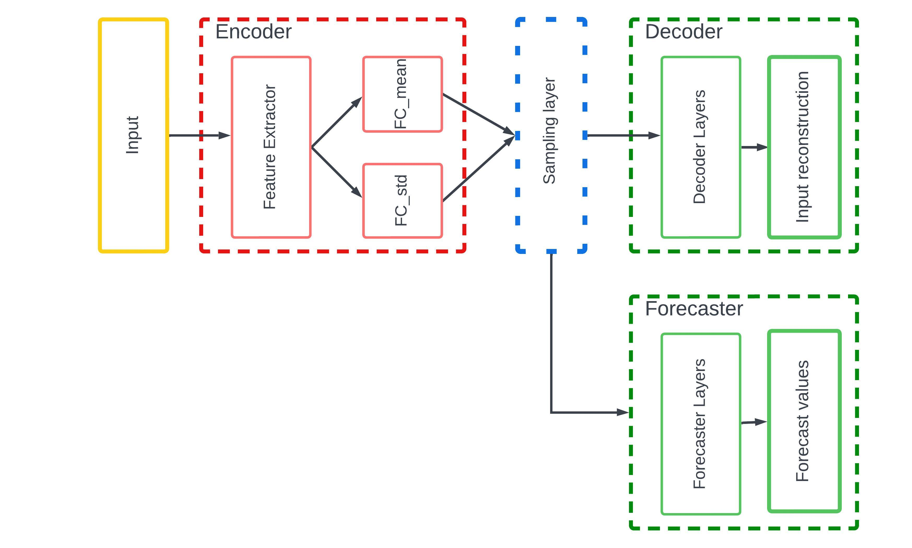
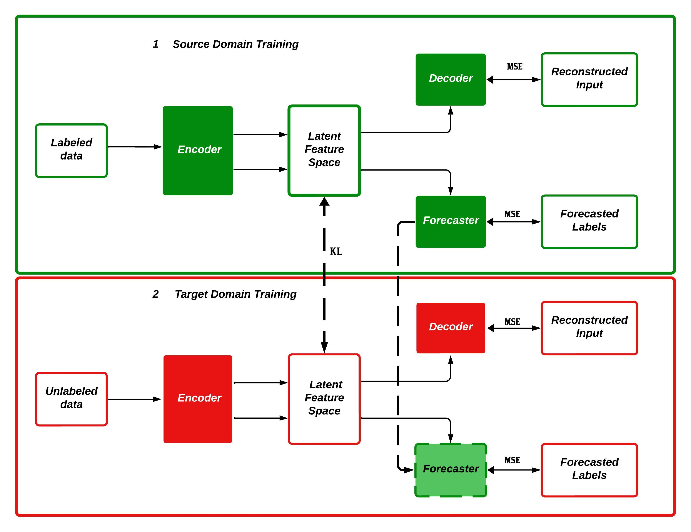

## DRFN - Deep Reconstruction Forecast Network

This repository contains the code for the Deep Reconstruction Forecast Network (DRFN) architecture presented in our paper titled "Unsupervised Domain Adaptation Framework for Photovoltaic Power Forecasting Using Variational Auto-Encoders".The code has been made available to support reproducibility and foster further research in renewable energy (RE) forecasting.
The DRFN framework addresses critical challenges in day-ahead energy production forecasting, particularly for newly installed photovoltaic (PV) plants where labeled historical data is unavailable. By employing a feature-based unsupervised domain adaptation approach, the DRFN architecture enables effective knowledge transfer without relying on adversarial training, offering a practical and computationally efficient alternative.

Our approach provides significant contributions, including:
- Introducing a novel DRFN architecture that extends the Deep Reconstruction Classification Network (DRCN).
- Demonstrating unsupervised domain adaptation for forecasting without labeled target domain data.

This repository includes all the tools required to train and test the DRFN model, along with utilities for data preprocessing and customization.

## Deep Reconstruction Forecast Network (DRFN) 

The proposed Deep Reconstruction Forecast Network is designed to perform time-series forecasting with a focus on extracting discriminative and robust features. It integrates a Variational Autoencoder (VAE) architecture for stochastic feature extraction. The network is composed of three main components:

- Encoder: Extracts features from the input data and maps them to a latent feature space. This space is modeled as a Gaussian distribution, with the encoder estimating its mean and standard deviation.
- Decoder: Reconstructs the input data from the latent feature space, ensuring that the features retain the intrinsic structure of the input data.
- Forecaster: Maps the features in the latent space to the forecast labels, enabling accurate prediction.



## Transfer Learning with DRFN

The DRFN enables domain adaptation through a two-step process:

### Training in the Source Domain
- The encoder, decoder, and forecaster are trained together using labeled data from the source domain.
- This step establishes a robust latent feature space and a forecasting model optimized for the source data.

### Adaptation to the Target Domain
1. In the target domain, where labeled data may be limited or unavailable, the forecaster trained on the source domain remains unchanged.
2. The encoder-decoder pair is fine-tuned to align the feature space of the target domain with that of the source domain. 
   - This alignment is achieved by minimizing the divergence between the feature distributions of the two domains.
3. The alignment ensures that the forecaster can seamlessly operate on the target domain without requiring additional supervised training.




## Setup and Installation

To use this code, you will need to set up a Python virtual environment and install the necessary dependencies. Please follow the steps below:

### Create and activate Virtual Environment

Create a new Python virtual environment. You can do this by running the following commands:

```bash
# Create the virtual environment (change 'env_name' to your preferred name)
python3 -m venv env_name
```
Activate the virtual environment 
```bash
# macOS/Linux
source env_name/bin/activate
# Windows
env_name\Scripts\activate
```
### Install Required Packages
Once the virtual environment is activated, install the required Python packages by running:
```bash
pip install -r requirements.txt
```
This will install all the necessary dependencies for the project.

## Model Training and Testing

To train the DRFN model, you need to provide your own CSV file with data. Follow these steps:

### Format of the CSV File
Ensure your CSV files are formatted properly. It should contain time series data containing a datetime index column. Make sure the CSV has proper headers and the "target column" is in the first column or you can change the data transformation codes in utilities.py to suit your dataset. 

### Modify csv file path in code

After preparing your CSV file, open the train_source_drfn.py file and change the file path to your own CSV file in the appropriate section of the code:

```python
csv_file_path = 'path_to_your_file.csv'
```

### Modify the model parameters

In  the train_source_drfn.py and update model parameters to suit your needs. 

```python
# Model parameters used to structure input tensors and model input/output shapes 
window_len = 12 # number of historical datapoints to consider
forecast_len = 12 # forecast length to consider
latent_dim = 2 # latent dimension 
n_total_features = 18 # number of features in the dataset
batch_size = 50 # batch size for data batching
```

### Creation of Tensorflow dataset objects and build model 

In the train_source_drfn.py make any updates to training sizes and test sizes and split data. The training and testing split needs to be done before the datasets being processed into tensor_objects. The code is structured such that no modifications are required if correct format of pandas dataframe is created.  

```python
training_data = utilities.create_dataset(df_training,window_size, forecast_size,batch_size)
test_data = utilities.create_dataset(df_training,window_size, forecast_size,batch_size)
```
The pandas dataframe that needs to be injested by "create_dataset" method in utilities.py, needs to have a datetime index and the target label column in the first columnn index. The "create_dataset" method outputs tesorflow dataset object for model input  as (input,target_label) of with tensors of shapes ((batchsize,window_len,n_total_features),(batchsize,forecast_len,1)).
 
### Training the Model

Finally modify the path to save model in the training script 
 ```python
drfn.save('drfn_source.keras')
```
Save the train_source_drfn.py file and run the script:
```bash
python train_source_drfn.py
```

### Testing the Model

Run the test_source_drfn.py script:
```bash
python train_source_drfn.py
```
### Transferlearning

if you wish to implement the transferlearning framework, simply change the csv file path in either of the "transferlearn_target*_drfn.py" files and follow the same steps of data transformations before training.
If you wish to implement transferlearning without labelled data in target domains make sure you use the "DRFN_target" class present in "drfn.py" with the keyword argument "forecastor_training" set to Flase. 

```python
encoder = drfn_components.create_encoder(n_total_features,window_len,latent_dim)
decoder = drfn_components.create_decoder(n_total_features,window_len,latent_dim)
drfn_source = keras.models.load_model('your path to saved source model.keras')
encoder_source = drfn_source.encoder
forecaster_source = drfn_source.forecaster
drfn_target = drf.DRFN_target(encoder_source,encoder, decoder, forecaster_source,forecastor_training=False)
drfn_target.build(input_shape=(None, window_len, n_total_features))
```

the "DRFN_target" class present in "drfn.py" with the keyword argument "forecastor_training" set to True. 

```python
encoder = drfn_components.create_encoder(n_total_features,window_len,latent_dim)
decoder = drfn_components.create_decoder(n_total_features,window_len,latent_dim)
drfn_source = keras.models.load_model('your path to saved source model.keras')
encoder_source = drfn_source.encoder
forecaster_source = drfn_source.forecaster
drfn_target = drf.DRFN_target(encoder_source,encoder, decoder, forecaster_source,forecastor_training=True)
drfn_target.build(input_shape=(None, window_len, n_total_features))
```

### Modifying the Model

The architecture of DRFN can be modified according to your needs. To change the layers of the model, you need to interact with the model_components.py file.

Within the model_components.py, you will find the model configurations defined for Encoder, Decoder and Forecaster. 
Simply change the layer configuration of the respective model you want. For example: adding a dense layer to the forecaster module. 

```python
def create_forecaster(latent_dim, forecast_len):
    latent_inputs = layers.Input(shape=(latent_dim,))
    x = layers.Dense(forecast_len * 10, activation="relu")(latent_inputs)
    x = layers.Reshape((forecast_len, 10))(x)
    x = layers.LSTM(50, return_sequences=True, activation="tanh")(x)
    x = layers.LSTM(25, return_sequences=True, activation="tanh")(x) 

    # add a new lstm layer 
    x = layers.LSTM(15, return_sequences=True, activation="tanh")(x) 

    forecaster_outputs = layers.Dense(1, activation="linear")(x)
    forecaster = keras.Model(latent_inputs, forecaster_outputs, name="forecast")
    forecaster.summary()

    return forecaster
```
## Utilities

In addition to the main model, you will find utility functions for data preprocessing and transformation under the utilities.py. This includes data scaling, normalization, time series data transformations, and other relevant functions.If you need custom transformations or data preprocessing, you can modify or add functions in these utility scripts to suit your data.


